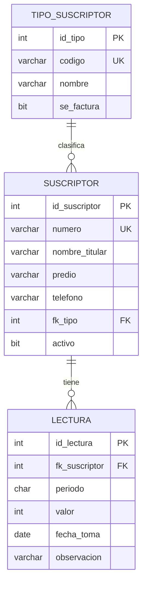

# Evaluación individual — Aplicación y Servicios Web · **SUPLETORIO**

**Tecnología en Desarrollo de Software · Institución Universitaria ITM**

| | |
|---|---|
| **Grupo** | **580202009 — Aplicación y Servicios Web** |
| **Carácter** | **Supletorio.** Reemplaza la evaluación individual |
| **Stack** | **API en C# / ASP.NET Core sobre SQL Server** · el **front, en la tecnología que usted quiera** |
| **Modalidad** | **Individual** |
| **Peso** | **20 %** |
| **Fecha** | **sábado 19 de septiembre de 2026** |
| **Hora** | **de 2:00 p. m. a 6:00 p. m.** |
| **Entrega** | a las **6:00 p. m.**: lo que esté en su repositorio |

> **Este enunciado es distinto al de sus compañeros.** El problema es otro, y
> las preguntas de sustentación son **más exigentes**: se responden leyendo
> **su propio código**, no repitiendo definiciones.

---

# PARTE 0 · LO QUE HAY QUE HACER ANTES DE LEER EL PROBLEMA

**Léalo completo. Son diez minutos y valen 10 % de la nota.**

---

## 0.1 · El repositorio: **privado, y con `ccastro2050` invitado**

**Los tres pasos, en orden, antes de tocar el problema:**

### Paso 1 · Créelo en GitHub

1. Entre a **https://github.com/new**
2. **Repository name:** `evaluacion_aysw_supletorio`
3. **Marque `Private`.** ← esto no es opcional
4. **NO marque** «Add a README file», ni `.gitignore`, ni licencia
5. **Create repository**

> **¿Por qué privado?** Porque es una evaluación. Un repositorio público lo ve
> cualquiera, incluido quien la presente después que usted.
>
> **¿Por qué sin README?** Para que la primera pantalla le muestre los comandos
> exactos que necesita. Si lo marca, no pasa nada grave, pero le tocará hacer
> `git pull` antes del primer `push`.

### Paso 2 · Invíteme — **sin esto, su entrega no existe**

1. En su repositorio: **Settings** → **Collaborators**
2. **Add people**
3. Escriba exactamente: **`ccastro2050`**
4. **Add to this repository**

> **Esto se hace AHORA, no al final.** Si su repositorio es privado y yo no
> estoy invitado, **yo no puedo abrirlo**, y a las 6:00 p. m. no hay nada que
> calificar. No es rigor: es que literalmente no veo nada.
>
> **En las evaluaciones anteriores esto pasó, y no hubo nota que poner.**

### Paso 3 · Conecte su carpeta y haga el primer `push`

En la carpeta de su proyecto, **cambiando `SU_USUARIO`**:

```bash
git init
git add .
git commit -m "Fase 0 — estructura inicial y base de datos cargada"
git branch -M main
git remote add origin https://github.com/SU_USUARIO/evaluacion_aysw_supletorio.git
git push -u origin main
```

### Paso 4 · **Compruébelo con los ojos**

**Abra su repositorio en el navegador y mire si sus archivos están ahí.**

| Lo que ve | Qué significa |
|---|---|
| Sus carpetas y archivos | **El `push` funcionó.** Siga |
| «This repository is empty» | **El `push` NO funcionó.** Arréglelo ahora, no a las 5:55 |

> **No dé por hecho que funcionó porque la consola no dio error.** Míre­lo.
> Treinta segundos aquí le ahorran perder la evaluación completa.

---

## 0.2 · Los commits: **uno por fase**

**Esta evaluación se lee en el historial de Git.** No se califica solo lo que
hay al final: se califica **cómo llegó ahí**.

### La regla, en una línea

> Su `8_tasks.md` tiene **mínimo nueve fases**, y **cada fase deja al menos un
> commit** cuyo mensaje **empieza por el número de la fase**.

### Cómo se hace un commit que vale

```bash
git add .
git commit -m "Fase 3 — Interfaces y repositorio SQL Server

IRepositorioSuscriptor y RepositorioSuscriptorSqlServer, con las consultas
parametrizadas. Al probar el listado devolvia 500: faltaba el using de
Microsoft.Data.SqlClient. Corregido y probado: devuelve las 6 filas."
git push
```

**Tres partes, y las tres se revisan:**

| | | |
|---|---|---|
| **1** | `Fase 3 —` | El número al principio. Es lo que permite leer el historial de corrido |
| **2** | Una línea corta | Qué quedó hecho |
| **3** | El detalle | **Qué probó y qué respondió el sistema.** Esto es lo que separa un commit que vale de uno que no |

### Qué NO vale

| Esto | Por qué no |
|---|---|
| `git commit -m "avance"` | No dice qué fase ni qué probó. Es un respaldo, no un registro |
| `git commit -m "Initial commit"` | Lo mismo |
| **Un solo commit al final** | Se pierden los 10 puntos del historial, y las preguntas 1 y 10 se quedan sin nada que citar |
| Nueve commits, todos a las 5:52 p. m. | **El historial guarda la hora.** Se ve que se hicieron juntos |

### Dos cosas que conviene entender bien

**1 · Comitear y empujar no son lo mismo, y el `push` puede esperar.**

Git guarda **la fecha de cada commit**, no la del `push`. Si comitea a las 2:30,
3:10 y 4:05 y empuja todo junto a las 5:40, el historial muestra **los tres
con sus horas reales**. Nadie pierde nota por eso.

> **Pero empuje de vez en cuando igual**, y por una razón práctica: **para
> saber que su `push` funciona.** Si falla a las 5:55 —credenciales, rama,
> un conflicto— no hay tiempo de arreglarlo, y cuatro horas de trabajo no
> quedan en ninguna parte.

**2 · Cuando algo falla, se comitea la corrección.**

**Un historial con correcciones vale más que uno impecable.** Nueve commits
perfectos, sin un solo tropiezo, con base de datos, API y front en cuatro
horas, no le pasa a nadie. Ese historial no dice «trabajé bien»: dice **«subí
al final lo que ya tenía»**.

```
Fase 5 (correccion) — el PATCH respondia 422

PATCH /api/suscriptores/3 con {"telefono":"3004455"} devolvia 422
"el campo direccion es obligatorio". La peticion de PATCH heredaba de
la de reemplazo, que exige todos los campos. Se separo en
SuscriptorActualizar con los campos opcionales. Ahora responde 200.
```

**Y si una fase no sale, siga y vuelva después**, dejando el rastro:

1. `Fase 4 — parcial: la prueba de capas falla, sigo con el controlador`
2. Avanza con lo demás.
3. `Fase 4 (correccion) — la prueba de capas pasa`

---

## 0.3 · Las nueve fases

**Ninguna fase termina porque el código esté escrito: termina cuando se
probó.** Cada una trae **una** comprobación, de un minuto:

| Fase | Qué se hace | Cómo se comprueba |
|---|---|---|
| **0** | Base de datos y esqueleto | La base carga y usted **cuenta las filas** de las tres tablas |
| **1** | Los modelos (las clases entidad) | `dotnet build` compila |
| **2** | Las peticiones por verbo y la excepción | Compila, y **crear, reemplazar y actualizar son tres clases distintas** |
| **3** | Interfaces y repositorios SQL Server | El repositorio **trae filas de verdad** de la base |
| **4** | Servicios y prueba de capas | La prueba de capas **pasa**, y el servicio **no menciona HTTP** |
| **5** | Controladores y `Program.cs` | Los **seis endpoints** responden, incluidos el **422** del `PUT` y el **200** del `PATCH` |
| **6** | El front | La pantalla **lista y crea**, y **sigue en pie con la API apagada** |
| **7** | Docker: un solo comando | `docker compose up -d --build` **desde cero** levanta los tres servicios |
| **8** | Cierre | `9_checklist.md` firmado y `RESPUESTAS.md` diligenciado |

**El spec kit va ANTES de la Fase 1**, y también deja su commit.
**Nueve es el mínimo, no el máximo.**

---

# PARTE 1 · EL PROBLEMA

## 1. Qué se evalúa

| | |
|---|---|
| **Lo que construye** — 65 % | La versión 1 funcionando, y **el rastro de cómo la construyó** |
| **Lo que sabe explicar** — 35 % | Las respuestas de `RESPUESTAS.md`, **ancladas a su propio código** |

**El diseño viene resuelto.** El problema, el contexto, el modelo
entidad-relación, el relacional normalizado y el script **se los entregan
hechos**, junto con el plan y las historias. Usted **no diseña la base**:
escribe el spec kit de la versión 1 y la construye.

---

## 2. El problema

En la vereda no llega el acueducto municipal. El agua la administra una
**junta de acueducto veredal**: los vecinos se organizan, captan el agua de
una quebrada, la tratan como pueden, y la reparten por manguera a las casas.

**Hoy la junta lleva las cuentas en un cuaderno.** El fontanero pasa casa por
casa anotando la lectura del medidor, y el tesorero después saca la cuenta a
mano. Cuando alguien reclama que le cobraron de más, **no hay cómo demostrar
nada**: la lectura anterior está en una hoja que se mojó, o la anotó otro
fontanero con otra letra.

Y hay un problema peor que el cobro: **nadie sabe cuánta agua se está
perdiendo**. La junta capta un caudal, factura otro, y la diferencia —las
fugas— no aparece en ninguna parte hasta que se seca el tanque.

**Se necesita un sistema que registre quién está suscrito, en qué predio, y
qué lectura tuvo su medidor en cada período** — para que el cobro se pueda
sustentar y las pérdidas se puedan ver.

---

## 3. El contexto

> Lo que dijo la tesorera de la junta, en la reunión:

> **`03:20`** — «Cada casa es un suscriptor. Tiene un número de suscripción
> que le pusimos nosotros, y ese no se repite. Pero el dueño puede cambiar:
> la casa se vende y sigue siendo la misma suscripción.»

> **`06:45`** — «El medidor se lee una vez al mes. Yo anoto la lectura, y el
> consumo es la resta con la del mes pasado. **Si la lectura nueva es menor
> que la anterior, es que cambiaron el medidor** — o que alguien lo movió.»

> **`09:10`** — «Los suscriptores no son todos iguales. Hay residenciales,
> hay dos tiendas y hay una escuela. A la escuela no le cobramos, pero sí le
> medimos, porque el agua que gasta también sale del tanque.»

> **`12:30`** — «Un suscriptor se puede retirar. Pero **no lo borramos**: si
> alguien pregunta por el consumo de esa casa en 2024, tengo que poder
> decirle.»

> **`15:55`** — «Lo que más necesito es el listado de lecturas del mes, para
> pasarlo a la reunión. Y el de los que no han reportado lectura.»

> **`18:40`** — «Una vez metí dos veces la lectura de marzo de la misma casa y
> la cuenta salió al doble. Eso no puede volver a pasar.»

---

## 4. Las historias de usuario — **la versión 1**

**Vienen firmadas. No las cambie.**

| # | Como… | quiero… | para lograr… |
|---|---|---|---|
| **1** | tesorera | registrar los suscriptores con su predio y tipo | tener el padrón completo sin depender del cuaderno |
| **2** | tesorera | consultar el padrón y filtrarlo por tipo | saber cuántas residenciales, comerciales y oficiales hay |
| **3** | tesorera | corregir los datos de un suscriptor | que un teléfono o una dirección mal anotados no queden así |
| **4** | tesorera | retirar un suscriptor sin borrarlo | conservar el histórico de consumo de ese predio |
| **5** | fontanero | registrar la lectura del medidor de un período | que el consumo se calcule solo y se pueda sustentar |

---

## 5. El modelo entidad-relación



**Tres entidades, y una relación que no es obvia:** `TIPO_SUSCRIPTOR` tiene
`se_factura`, porque la escuela **se mide pero no se cobra** (`09:10`). Ese
campo no es un adorno: es la regla del dominio hecha dato.

---

## 6. El modelo relacional

```
tipo_suscriptor(id_tipo PK, codigo UK, nombre, se_factura)

suscriptor(id_suscriptor PK, numero UK, nombre_titular, predio,
           telefono, fk_tipo FK→tipo_suscriptor, activo)

lectura(id_lectura PK, fk_suscriptor FK→suscriptor, periodo,
        valor, fecha_toma, observacion)
        UNIQUE (fk_suscriptor, periodo)   ← de 18:40
```

**Está en 3FN.** Y fíjese en la restricción `UNIQUE (fk_suscriptor, periodo)`:
sale directo de `18:40` —«metí dos veces la lectura de marzo»—. **Una frase de
la reunión que se volvió una restricción del motor.**

---

## 7. El script de la base

**Se lo entregan hecho.** Va en `db/bdacueducto.sql`.

```sql
-- ===========================================================================
--  Junta de acueducto veredal  ·  SQL Server
--  Se entrega HECHO. No hay que disenarlo: hay que construir encima.
-- ===========================================================================

CREATE DATABASE bdacueducto;
GO
USE bdacueducto;
GO

CREATE TABLE tipo_suscriptor (
    id_tipo     INT IDENTITY(1,1) NOT NULL,
    codigo      VARCHAR(10)       NOT NULL,
    nombre      VARCHAR(60)       NOT NULL,
    se_factura  BIT               NOT NULL DEFAULT 1,

    CONSTRAINT pk_tipo_suscriptor PRIMARY KEY (id_tipo),
    CONSTRAINT uq_tipo_codigo     UNIQUE (codigo)
);
GO

CREATE TABLE suscriptor (
    id_suscriptor   INT IDENTITY(1,1) NOT NULL,
    numero          VARCHAR(15)       NOT NULL,
    nombre_titular  VARCHAR(120)      NOT NULL,
    predio          VARCHAR(150)      NOT NULL,
    telefono        VARCHAR(20)       NULL,
    fk_tipo         INT               NOT NULL,
    activo          BIT               NOT NULL DEFAULT 1,

    CONSTRAINT pk_suscriptor      PRIMARY KEY (id_suscriptor),
    -- de 03:20: el numero de suscripcion no se repite
    CONSTRAINT uq_suscriptor_num  UNIQUE (numero),
    CONSTRAINT fk_suscriptor_tipo FOREIGN KEY (fk_tipo)
        REFERENCES tipo_suscriptor (id_tipo)
);
GO

CREATE TABLE lectura (
    id_lectura     INT IDENTITY(1,1) NOT NULL,
    fk_suscriptor  INT               NOT NULL,
    periodo        CHAR(7)           NOT NULL,   -- 'AAAA-MM'
    valor          INT               NOT NULL,
    fecha_toma     DATE              NOT NULL,
    observacion    VARCHAR(200)      NULL,

    CONSTRAINT pk_lectura        PRIMARY KEY (id_lectura),
    CONSTRAINT fk_lectura_susc   FOREIGN KEY (fk_suscriptor)
        REFERENCES suscriptor (id_suscriptor),
    -- de 18:40: una sola lectura por casa y por periodo
    CONSTRAINT uq_lectura_per    UNIQUE (fk_suscriptor, periodo),
    -- un medidor no marca negativo
    CONSTRAINT chk_lectura_valor CHECK (valor >= 0)
);
GO

-- --------------------------------------------------------------------------
--  Datos de prueba
-- --------------------------------------------------------------------------
INSERT INTO tipo_suscriptor (codigo, nombre, se_factura) VALUES
    ('RES', 'Residencial',  1),
    ('COM', 'Comercial',    1),
    ('OFI', 'Oficial',      0);   -- la escuela: se mide, NO se cobra
GO

INSERT INTO suscriptor (numero, nombre_titular, predio, telefono, fk_tipo, activo) VALUES
    ('AC-001', 'Rosa Elena Munoz',  'Lote 4, sector alto',   '3104455667', 1, 1),
    ('AC-002', 'Jairo Restrepo',    'Finca La Esperanza',    '3115566778', 1, 1),
    ('AC-003', 'Tienda La Cascada', 'Via principal km 2',    '3126677889', 2, 1),
    ('AC-004', 'Escuela Rural',     'Vereda centro',         NULL,         3, 1),
    ('AC-005', 'Omar Zapata',       'Lote 11, sector bajo',  '3137788990', 1, 0),
    ('AC-006', 'Tienda El Molino',  'Cruce de la quebrada',  '3148899001', 2, 1);
GO

INSERT INTO lectura (fk_suscriptor, periodo, valor, fecha_toma, observacion) VALUES
    (1, '2026-07',  1240, '2026-07-05', NULL),
    (1, '2026-08',  1298, '2026-08-05', NULL),
    (2, '2026-07',   870, '2026-07-05', NULL),
    (2, '2026-08',   902, '2026-08-05', NULL),
    (3, '2026-07',  3110, '2026-07-06', NULL),
    (3, '2026-08',  3405, '2026-08-06', 'Se reviso, no hay fuga'),
    (4, '2026-08',   560, '2026-08-06', NULL),
    (6, '2026-08',    45, '2026-08-06', 'Medidor nuevo, empieza en cero');
GO
```

> **Los datos traen cosas a propósito:** un suscriptor **retirado**
> (`AC-005`), uno **que no se factura** (la escuela), uno **sin lectura de
> julio** (para la consulta de «quién no ha reportado»), y uno con **medidor
> cambiado** (`AC-006`, empieza en 45 después de nada).

---

## 8. Su versión 1

**Construye el CRUD completo de `suscriptor`**, con API y front.

| Verbo | Ruta | Qué hace | Códigos |
|---|---|---|---|
| `GET` | `/api/suscriptores` | Lista los **activos** | `200` |
| `GET` | `/api/suscriptores/{id}` | Uno | `200` · `404` |
| `POST` | `/api/suscriptores` | Crea | `201` · `422` |
| `PUT` | `/api/suscriptores/{id}` | Reemplaza **completo** | `200` · `404` · `422` |
| `PATCH` | `/api/suscriptores/{id}` | Actualiza **parcial** | `200` · `404` · `422` |
| `DELETE` | `/api/suscriptores/{id}` | **Retiro lógico** | `204` · `404` |

> **`PUT` y `PATCH` no comparten la clase de petición.** El `PUT` exige todos
> los campos; el `PATCH` acepta algunos. Si comparten, uno de los dos está mal
> — necesariamente.
>
> **El `DELETE` es retiro lógico**, porque `12:30` lo dice: *«no lo borramos,
> tengo que poder decirle el consumo de 2024»*.

### Las tres capas

```
Controlador  →  Servicio  →  Repositorio  →  SQL Server
   (HTTP)       (reglas)      (SQL)
```

| Capa | **NO puede** |
|---|---|
| Controlador | Una sola línea de SQL |
| **Servicio** | Mencionar HTTP: ni `IActionResult`, ni códigos de estado |
| Repositorio | Decidir reglas de negocio |

### El front

**La tecnología, la que quiera.** Se revisa:

1. **Lista** los suscriptores.
2. **Crea** uno.
3. **Muestra el error del `422` en la pantalla**, no en la consola.
4. **No se cae con la API apagada**: dice «no se pudo conectar» y sigue en pie.

---

## 9. Si el tiempo aprieta

| Primero suelte | Después | **Nunca** |
|---|---|---|
| El `PATCH` | El front bonito | **El spec kit antes del código** |
| Docker | El filtro por tipo | **Los commits por fase** |
| | | **`RESPUESTAS.md`** |

> **`RESPUESTAS.md` vale 35 %.** Un `GET` y un `POST` funcionando con las diez
> preguntas bien respondidas valen más que los seis endpoints con el archivo
> en blanco.

---

## 10. Qué entrega

| | |
|---|---|
| **El repositorio privado**, con `ccastro2050` invitado | **desde el minuto uno** |
| El spec kit completo | **Comiteado antes del código** |
| La API y el front | Lo que alcance, con el orden de §9 |
| `RESPUESTAS.md` | **Las diez preguntas** |
| **El historial** | **Mínimo nueve commits, uno por fase** |

---

## 11. Rúbrica

| | | |
|---|---|---|
| **Spec kit** | **10 %** | Completo y **antes** del código |
| **Las tres capas** | **15 %** | La prueba de capas pasa · el servicio no sabe de HTTP |
| **Los seis endpoints** | **20 %** | `PUT` ≠ `PATCH` · **retiro lógico** · los códigos correctos |
| **Front** | **5 %** | Lista, crea, muestra el error, no se cae |
| **Docker** | **5 %** | `docker compose up -d --build` desde cero |
| **Historial de commits** | **10 %** | **Uno por fase, con lo que probó. Ver §0.2** |
| **`RESPUESTAS.md`** | **35 %** | **Ancladas a su código, con archivo y línea** |

---

## 12. El orden de trabajo

1. **Repositorio privado + invitación + primer `push` comprobado** (§0.1).
2. Lea el problema, el contexto y las historias. Marque `[NECESITA
   ACLARACIÓN]` lo que no diga, **o diga de dos maneras distintas**.
3. Cree la estructura y copie el script en `db/bdacueducto.sql`.
4. **Escriba el spec kit completo** y comitéelo. **Ahí se gana o se pierde.**
5. De ahí: **fase, prueba, commit.** Y si falla, corrección y commit.
6. Al cerrar, la Fase 8: `9_checklist.md` firmado y `RESPUESTAS.md`
   diligenciado, **antes de las 6:00 p. m.**.

---

## 13. Lo que costó nota en las evaluaciones de este semestre

**No es una advertencia genérica. Pasó, y a compañeros suyos.**

| Lo que pasó | Lo que costó |
|---|---|
| **No invitó a `ccastro2050`** | **Entrega inexistente.** No hubo nota que poner |
| **Un solo commit, faltando cinco minutos** | Los 10 puntos del historial, y las preguntas sin nada que citar |
| **Commits que decían «avance», «cambios»** | No se pudo saber qué hizo en qué momento |
| **`PUT` y `PATCH` con la misma clase** | Se perdió el punto de los verbos en casi todos |
| **El servicio devolvía `IActionResult`** | Las capas rotas, y la prueba de la Fase 4 falla |
| **El `DELETE` borraba la fila** | Contradice el enunciado y la historia 4 |
| **Respuestas genéricas en `RESPUESTAS.md`** | Cero: servían para cualquier proyecto |
| **Se atascaron en una fase y no salieron** | Entregaron la Fase 3 de nueve, a las cuatro horas |
